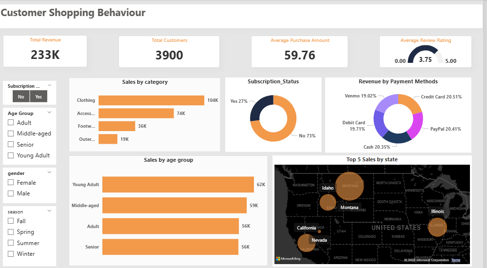

# Customer_Shopping_Behavior
End-to-end data analytics project analyzing customer shopping behavior using Python, SQL Server, and Power BI.
📊 Customer Shopping Behavior Analysis
🚀 Project Overview

This project focuses on analyzing customer shopping behavior to uncover meaningful insights and support data-driven decision-making. It demonstrates an end-to-end data analytics workflow, from data cleaning to visualization.

The pipeline includes:

Data cleaning using Python
Data storage and querying using SQL Server
Interactive dashboard creation using Power BI
🛠️ Tools & Technologies
Python (Pandas, NumPy)
SQL Server
Power BI
📂 Project Workflow
Data Cleaning & Preprocessing
Handled missing values and inconsistent formats
Converted data types 
Prepared clean dataset using Pandas
Data Storage (SQL Server)
Created structured tables
Imported cleaned data into SQL Server
Performed SQL queries for analysis
Data Visualization (Power BI)
Built interactive dashboards
Created calculated measures (KPIs)
Designed user-friendly visuals
📊 Key Metrics (KPIs)
Total Customers
Total Sales
Average Order Value
Repeat Customer Rate
📈 Insights Generated
Identified repeat vs new customer behavior
Analyzed purchase trends over time
Evaluated sales distribution across categories
Highlighted key factors influencing customer purchases
📸 Dashboard Preview

